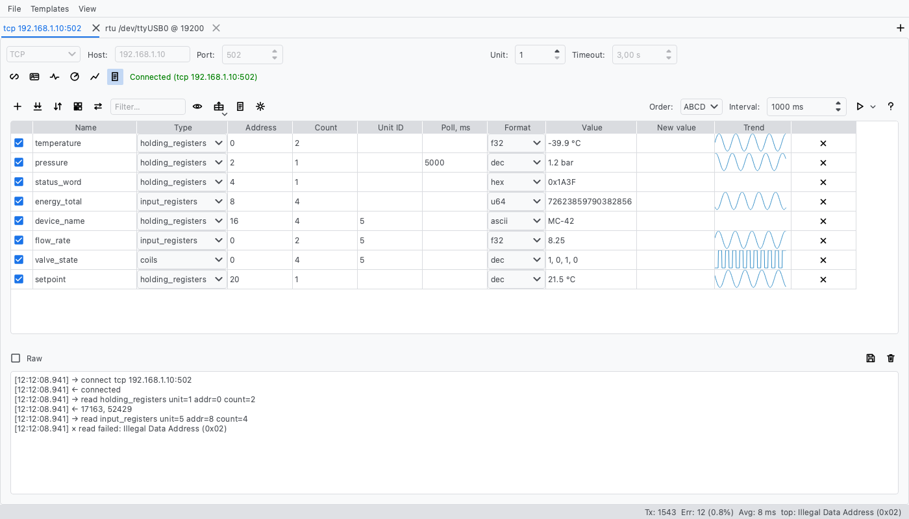
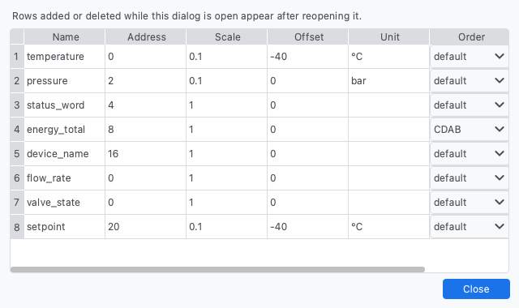
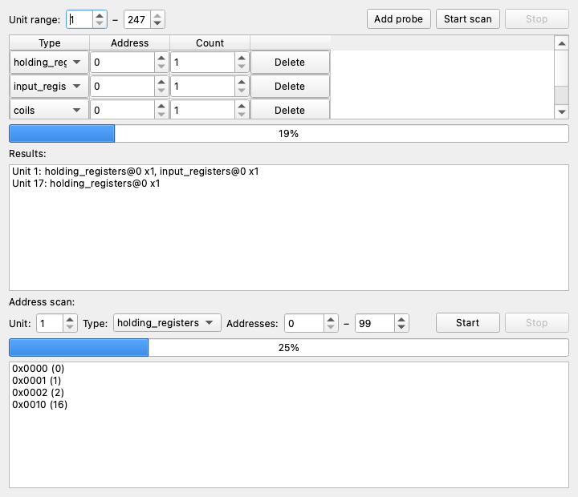

# modbus_connector

[Russian version: README_ru.md](README_ru.md)

A PySide6 GUI application for debugging Modbus buses and developing Modbus
devices. Works with Modbus TCP and Modbus RTU via synchronous pymodbus clients;
all Modbus logic runs in a separate thread (QThread), so the GUI never freezes.

## Features

- Multiple simultaneous connections in tabs: each tab is an independent
  session with its own connection, register table, log and scanner. Settings
  for all tabs persist between launches in
  `~/.modbus_connector/settings.json` (old single-session settings files keep
  working), and can also be saved to / loaded from an arbitrary JSON file via
  the File menu.
- Connection types: TCP (host, port, timeout), RTU (serial port, baudrate,
  parity, etc.; RTU by default) and **RTU over TCP / RTU over UDP** for
  RS-485↔Ethernet converters — all configured in the GUI.
- Register table: rows with a name, area type (coils, discrete inputs,
  holding/input registers), address and count; read and write values.
  Enter in the "New value" column sends the write command, Ctrl+R (Cmd+R on
  macOS) reads the current row; the whole table is keyboard-friendly.
- Rich value display: per-row formats (dec/hex/s16/u32/s32/f32/u64/s64/f64/
  ascii) with byte order variants (ABCD/CDAB/BADC/DCBA), scaling with offset
  and engineering units; a value that changed between reads flashes for a
  couple of seconds.
- Per-row Unit ID (rows can address different devices on the same bus) and
  per-row polling interval (slow and fast registers in one table).
- Filter box and one-click "Sort by address" for large tables.
- Advanced protocol functions: Mask Write Register (0x16), Read/Write Multiple
  Registers (0x17), Read Device Identification (0x2B) and serial-line
  Diagnostics (0x08) — via dedicated dialogs.
- Link visibility: transaction statistics in the status bar (count, errors
  with percentage, top error kind, average response time), human-readable
  Modbus exception names and a live connection indicator (green = alive,
  orange "(idle)" = link idle or degraded).
- Address scanner ("Scanner…" button, separate window): iterates unit ids in
  a given range with configurable probes and shows devices that answered at
  least one probe; double-click a found unit to select it for the connection.
  A second sweep scans the register address space of a known unit and lists
  the addresses that respond.
- Log panel at the bottom of the window, toggled with the "Log" button:
  human-readable requests/responses, optional raw bus traffic in hex
  ("Raw" checkbox) and export of the whole log to a file ("Save…").

## Screenshots

Main window — two connection tabs, register table with read values, log:



Per-row display settings — Scale/Offset/Unit and a byte-order override per
register row (the "Display…" button above the table):



Address scanner — unit sweep with probes and the register address scan:



## Requirements

- Python 3.11+
- `PySide6`, `pymodbus[serial]==3.6.9`

## Installation

```bash
python -m venv .venv
source .venv/bin/activate
pip install -e .[dev]
```

## Run

```bash
modbus-connector
# or
python -m modbus_connector
```

## Usage

### Connecting

1. Choose the connection type: **TCP** (host, port), **RTU** (serial port,
   baudrate, data bits, parity, stop bits — RTU is the default; use "Refresh"
   to rescan serial ports) or **RTU over TCP** / **RTU over UDP** (host, port —
   RTU frames inside a network socket, for RS-485↔Ethernet converters such as
   USR or Elfin).
2. Set the **Unit ID** of the target device (used for all register operations)
   and the response **Timeout**.
3. Press **Connect**. Input fields are locked while connected; press
   **Disconnect** to change settings.

The status label next to the button is live: green means the link is up,
orange with an "(idle)" suffix means the connection is configured but the last
transaction timed out — pymodbus reconnects transparently on the next request,
so this is informational, not an error. The status bar at the bottom of the
window shows transaction counters: total, errors with a percentage and the
most frequent error kind (the full breakdown by error type is in the label's
tooltip), plus the average response time of successful operations. Modbus
exception responses are reported by name (e.g. "Illegal Data Address (0x02)")
in the log.

### Working with tabs

The main window holds connections in tabs. The **+** button in the tab bar
corner opens another independent session — its own connection, register table,
log and scanner window. The tab title follows the connection (e.g. `tcp
192.168.1.10:502`); the last remaining tab cannot be closed. The status bar
statistics follow the active tab. All tabs are saved to the settings on exit
and restored on the next launch.

### Adding registers

Press **Add register** and fill in the row: an arbitrary **Name**, the area
**Type** (coils, discrete inputs, holding registers, input registers),
**Address** (decimal or hex, e.g. `0x10`) and **Count** (how many values to
read starting at the address). The optional **Unit ID** column overrides the
connection-wide unit for this row (empty = use the connection unit) — handy
for polling several devices on one RS-485 bus. All columns are plain cells —
the table is fully navigable with the keyboard. The ✕ button deletes a row.

### Reading values

- **Ctrl+R** (**Cmd+R** on macOS) — reads the row that has the keyboard focus.
- **Read all** — reads every row once.
- **Start polling** — reads all rows repeatedly with the interval set in the
  "Interval" field (milliseconds); press **Stop polling** to stop. The
  optional **Poll, ms** column overrides the interval per row (empty = global
  interval; finer values are effectively clamped to the global tick).

Read values appear in the **Value** column; every request and response is also
shown in the log panel (toggled with the "Log" button).

### Display formats, scaling and units

For register rows the **Format** column chooses how the Value column renders:
`dec` (default), `hex` (`0xNNNN`), `s16` (signed 16-bit), `u32`/`s32`/`f32`
(pairs of registers as one 32-bit value), `u64`/`s64`/`f64` (groups of four
registers) and `ascii` (two characters per register, e.g. device names and
serial numbers; the string ends at the first NUL byte). Coils and discrete
inputs always show 0/1.

Multi-register values are big-endian by default (the first register is the
high word); the **Order** combo above the table sets the byte layout for all
rows (`ABCD` default, `CDAB` word-swapped, `BADC` byte-swapped words, `DCBA`
full reverse), and a per-row override is available in the **Display…** dialog.
A leftover register that does not fill a whole 32/64-bit group is shown as-is.

The **Scale**, **Offset**, **Unit** and per-row **Order** settings live in the
**Display…** dialog above the table (one row per register row). The raw
registers are first decoded according to Format and Order, then each decoded
number is displayed as `x * scale + offset` with the unit appended
(e.g. `23.5 °C`). Scaling is skipped for the `hex` and `ascii` formats.
Table columns can be resized by dragging the header separators.

A value that changed since the previous read flashes green for ~2 seconds.

Use the **Filter…** box above the table to show only rows whose name, type,
address or unit id contains the text, and **Sort by address** to reorder the
table by address.

### Writing values

Type the value(s) into the **New value** column and press **Enter** — the
write command is sent immediately. Values are always raw: display scaling
(Scale/Offset) is never applied to them.

- registers: decimal or hex numbers (`4321`, `0x10E1`); for Count > 1 enter
  several values separated by commas or spaces (`1, 2, 0xFF`) — a single value
  uses function "write single register", several values use "write multiple
  registers";
- coils: `0`/`1`, `true`/`false`, `on`/`off` (case-insensitive).

After a successful write the row is re-read automatically, so the **Value**
column reflects the applied change. Parse errors and Modbus errors are
reported in the log panel.

Note: only coils and holding registers are writable — discrete inputs and
input registers are read-only by the protocol.

### Advanced protocol functions

- **Mask write (0x16)…** (button above the table) — Mask Write Register:
  AND/OR masks applied to one holding register, setting or clearing individual
  bits without touching the others. Table rows covering the address are
  re-read after a successful write.
- **Read/Write (0x17)…** — Read/Write Multiple Registers: writes values and
  reads back a range in one atomic transaction (no race window); the returned
  values go to the log.
- **Device ID…** (connection panel, enabled while connected) — Read Device
  Identification (0x2B/0x0E): vendor name, product code, revision and other
  objects reported by the device.
- **Diagnostics…** (connection panel, enabled while connected) — serial-line
  diagnostics (0x08): loopback echo check and bus/slave message counters with
  Refresh and Clear counters. This is a serial-line function, but some TCP
  devices answer it too.

### Scanning for devices

Press **Scanner…** to open the scanner window. Set the unit id range
(default 1–247) and the probe list (register type + address + count to try on
each address; sensible defaults are prefilled). **Start scan** begins the
sweep, **Stop** aborts it; units that answered at least one probe appear in
the results list. **Double-click a found unit** to copy it into the connection
panel's Unit ID field. Scanning pauses polling in the main window.

The **Registers scan** section below works the other way around: for a known
unit it reads a range of addresses of a chosen register type one by one and
lists every address that answered as `0xNNNN (dec)` — a quick way to map the
register space of an unfamiliar device.

The scanner's range, probe list and address-scan parameters persist in the
settings along with everything else.

### Log panel

The log panel at the bottom of the main window (toggled with the **Log**
button) shows every request and response with timestamps. The **Raw**
checkbox additionally displays raw bus frames in hex (`→ tx …` / `← rx …`) —
off by default to keep the log readable. **Save…** exports the entire log
(including raw frames hidden by the checkbox) to a text file; **Clear**
empties it.

### CSV import/export

The **CSV** drop-down above the table exchanges the register table with
spreadsheet tools:

- **Import table…** loads a CSV file and *replaces* the whole table (errors
  are reported in the log, an invalid file leaves the table untouched).
- **Export…** writes the current table as CSV: all table columns plus a final
  `value` column with the currently displayed (formatted/scaled) text —
  readable as a report and re-importable: the `value` column is simply
  ignored on import, so the round trip "export → edit in Excel → import"
  works out of the box.

The CSV has a header row with columns `name,kind,address,count,unit_id,
poll_ms,format,scale,offset,unit,order` (plus `value` in exports); empty
`unit_id`/`poll_ms` mean "use the connection unit / global interval", empty
`order` means "inherit the global order". Only `name`, `kind` and `address`
are required on import — missing optional columns fall back to defaults and
unknown columns are ignored. Files are written UTF-8 with BOM so Excel opens
them cleanly.


## Building a standalone executable

```bash
./build.sh        # macOS / Linux
build.bat         # Windows (cmd, also works by double-click)
```

The script installs PyInstaller (the `build` extra) and builds a standalone
application into `dist/`: on macOS — `ModbusConnector.app` plus a
`ModbusConnector.dmg` disk image; on Windows/Linux — a `ModbusConnector/`
folder with the executable inside (`ModbusConnector.exe` on Windows; copy the
whole folder to another machine). The artifact does not require Python on the
target machine.

macOS notes:

- Run: double-click `ModbusConnector.app` or `open dist/ModbusConnector.app`.
  Never run files from the intermediate `build/` directory (the script removes
  it after building).
- To move the app to another machine use the ready-made
  `dist/ModbusConnector.dmg` (do not rename or repack the `.app` into a `.pkg`
  yourself — such a file is not a valid installer).
- The app is ad-hoc signed: on another Mac Gatekeeper will warn about an
  unidentified developer on first launch — open via right-click → "Open", or
  remove the quarantine: `xattr -dr com.apple.quarantine ModbusConnector.app`.

Linux notes:

- RTU connections to serial ports (`/dev/ttyUSB*`, `/dev/ttyACM*`, etc.) require
  membership in the port's group, usually `dialout` (sometimes `uucp`). If you
  see `Errno 13` / "Permission denied" on connect, check the port:
  ```bash
  ls -l /dev/ttyUSB0
  ```
  Add your user to the group and re-login (or run `newgrp dialout`):
  ```bash
  sudo usermod -aG dialout $USER
  ```

## Project layout

```
src/modbus_connector/
  models.py       # Qt-free data types and helpers: TcpParams/RtuParams/
                  # RtuOverTcpParams/RtuOverUdpParams, RegisterRow, ScanProbe,
                  # DisplayFormat, ByteOrder, describe_connection(),
                  # parse_values()/format_values(),
                  # format_register_values()/format_scaled_values(),
                  # EXCEPTION_CODES/describe_exception(), Stats/StatsSnapshot
  backend.py      # ModbusBackend — synchronous pymodbus wrapper (no Qt):
                  # read/write, mask write (0x16), read/write registers (0x17),
                  # device identification (0x2B), diagnostics (0x08),
                  # unit scan, register address scan, raw traffic hook
  worker.py       # ModbusWorker (QObject) — signals/slots over backend, QThread;
                  # timing statistics, liveness checks, traffic forwarding
  connection_panel.py  # connection panel (TCP/RTU/RTU over TCP/RTU over UDP,
                       # state/set_state) with a live status indicator
                       # (gray/green/orange); Device ID…/Diagnostics… dialogs
  registers_panel.py   # register table: per-row unit/poll/format/order/scaling,
                       # change highlighting, filter/sort, Enter = write,
                       # Mask write…/Read/Write… dialogs
  scanner_panel.py     # unit scanner + register address scan (separate window)
  log_panel.py         # log panel (hideable): Raw hex traffic toggle, Save…
  settings_store.py    # settings persistence in ~/.modbus_connector/settings.json
  session_widget.py # SessionWidget — one Modbus session (panels, scanner
                    # window, worker thread) as a self-contained widget
  main_window.py  # main window: sessions in tabs, File menu,
                  # status bar following the active tab
  app.py          # QApplication creation and startup
  __main__.py     # python -m modbus_connector
tests/
  conftest.py     # modbus_server fixture: test Modbus TCP server on 127.0.0.1
  test_models.py  # value parsing/formatting, exceptions, Stats
  test_backend.py # ModbusBackend against the test server
  test_registers_panel.py  # offscreen Qt tests for the register table
  test_session_widget.py   # session state round-trip and shutdown
  test_main_window_tabs.py # tab lifecycle and settings round-trip
```

## Development

```bash
pytest          # tests
ruff check .    # lint
```

The backend tests start a real Modbus TCP server (pymodbus) on 127.0.0.1
with a free port and exercise read/write/scan through `ModbusBackend`.

## CI

GitHub Actions (`.github/workflows/build.yml`) runs tests and builds artifacts
for all three OSes on macOS/Windows/Linux runners on every push to `main`:
`modbus-connector-macos` (DMG), `modbus-connector-windows` and
`modbus-connector-linux` (zip with the executable). Download them from the
workflow run page (Actions → a run → Artifacts; kept for 90 days); a build can
also be started manually via "Run workflow".

Pushing a `v*` tag (e.g. `git tag v0.1.0 && git push origin v0.1.0`)
automatically attaches the same files to a GitHub Release — a permanent
download page (Releases in the repository).
